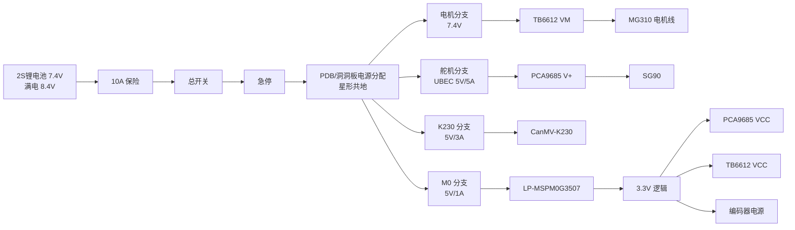

# 到货后傻瓜式装配与测试指南

版本：V0.1，到货首测用

目标：先让每个模块单独活，再让整车低速可控，最后再做巡线和云台视觉。
原则：每次只新增一个模块；接线前断电；电机测试时轮子必须悬空。

---

## 0. 先读这 8 条

1. 不要一上来把所有模块全接上电池。先测电源，再测主控，再测传感器，再测电机。
2. 每次改线前拔电池、拔 USB，万用表确认正负没有短路。
3. `M0 GPIO` 只能吃 3.3V。任何不确定的 5V 信号都先别接 M0。
4. `PCA9685 VCC` 是逻辑电源，接 M0 的 3.3V；`PCA9685 V+` 是舵机电源，接 5V UBEC。不要把舵机插在 M0 供电上。
5. `MG310` 有 6 根线，电机线和编码器线不是一回事。电机线接 TB6612 输出，编码器电源/A/B/GND 接 M0 逻辑侧。
6. 这批 MG310 资料显示空载约 `500rpm`、额定约 `400rpm`，比原来预估快。首测 PWM 从 `8%-12%` 开始。
7. 小车电机测试时，把车架垫起来，让四个轮子离地。
8. 看到冒烟、异味、异常发烫、M0/K230 反复重启，立即断电，不要继续试。

---

## 1. 到货资料确认

新增资料位置：

```text
references/vendor/车车/(B128)酷点机器人-310电机及底盘资料（3mm）/
references/vendor/车车/pca9685(1).jpg
references/vendor/车车/pca9685(2).jpg
```

已经从小车资料确认：

| 项目 | 结论 |
| --- | --- |
| MG310 型号 | `MG310 霍尔编码器减速电机` |
| 额定电压 | `7.4V`，资料建议使用范围 `7-13V` |
| 减速比 | `1:20.409` |
| 空载转速 | `500 ±13% rpm` |
| 额定转速 | `400 ±13% rpm` |
| 空载电流 | `<=220mA` |
| 额定电流 | `<=500mA` |
| 堵转电流 | `<=2A` |
| 编码器供电 | `3.3-5V` |
| 编码器输出 | AB 相方波 |
| 减速后编码器线数 | 约 `265.2` |

MG310 6Pin 线序按商家图从上到下：

| 位置 | 功能 | 接到哪里 |
| --- | --- | --- |
| 1 | 电机线 - | TB6612 某通道 OUTx |
| 2 | 编码器电源 | M0 `3.3V`，首测不要接 5V |
| 3 | 编码器输出 A 相 | M0 编码器 A 输入 |
| 4 | 编码器输出 B 相 | M0 编码器 B 输入 |
| 5 | 编码器地 | 公共 GND |
| 6 | 电机线 + | TB6612 某通道 OUTx |

注意：如果实际插头方向和图片不一致，先看电机外壳方向和资料图，必要时拍照标号。不要靠线色猜。

---

## 2. 推荐整车分区

从车尾看向车头，定义：

| 缩写 | 含义 |
| --- | --- |
| `LF` | 左前轮 |
| `RF` | 右前轮 |
| `LR` | 左后轮 |
| `RR` | 右后轮 |

建议摆放：

| 位置 | 放什么 |
| --- | --- |
| 底盘下层中后部 | 2S 电池，尽量低、居中 |
| 底盘下层左右 | 4 个 MG310 和轮子 |
| 底盘上层中部 | M0、PDB/洞洞板、降压模块、TB6612 |
| 车头下方 | 八路灰度模块，离地先调到 `5-10mm` |
| 车头上方或中前部 | SG90 二自由度云台，只放摄像头小模组和激光 |
| 底盘上层固定位置 | K230 主板，不要放到 SG90 云台上 |
| 远离电机线的位置 | PCA9685、IMU、OLED |

机械安装顺序：

1. 装 4 个电机支架和 MG310。
2. 装轮子，手转轮子，确认不蹭底盘。
3. 装万向轮/牛眼轮或支撑件，让底盘水平。
4. 装上层板和铜柱。
5. 先临时固定电子模块，不要一开始热熔胶封死。
6. 给每根线贴标签：`LF_M`、`RF_M`、`LR_M`、`RR_M`、`5V_SERVO`、`5V_K230`、`5V_M0`、`GND`。

如果电机安装螺丝太长，可能顶到电机内部。手转轮子变紧或卡住时，先换短螺丝。

---

## 3. 电源接线

### 3.1 电源总图



### 3.2 先只调电源，不接负载

把所有负载都拔掉，只接电池到电源分配和各降压模块输入。

| 分支 | 输出目标 | 用万用表测哪里 | 通过标准 |
| --- | --- | --- | --- |
| 电机分支 | `7.4V` | TB6612 的 `VM` 入口线端 | `7.3-7.5V` |
| 舵机分支 | `5.0V` | PCA9685 `V+` 入口线端 | `4.9-5.1V` |
| K230 分支 | `5.0V` | K230 5V 入口线端 | `4.9-5.1V` |
| M0 分支 | `5.0V` | M0 `VIN/5V` 入口线端 | `4.9-5.1V` |
| M0 板载 3.3V | `3.3V` | M0 `3V3` 到 GND | `3.25-3.35V` |

通不过就别往下接。尤其是 `PCA9685 VCC` 和 `PCA9685 V+`，必须分清。

---

## 4. 主控和总线先活起来

### 4.1 M0 最小上电

接线：

| M0 | 接到 |
| --- | --- |
| `VIN/5V` | M0 5V 分支输出 |
| `GND` | 公共 GND |
| USB | 电脑，用于下载和串口调试 |

测试：

1. 不接 TB6612、不接舵机、不接 K230。
2. 插 USB，下载最小程序：LED 闪烁或串口打印 `M0 alive`。
3. 再接 M0 5V 分支，拔掉 USB，只用电池供电，确认 M0 仍能启动。

通过现象：LED 正常闪烁，M0 不重启，3.3V 稳定。

### 4.2 推荐做一个测试菜单

后续所有硬件测试最好共用一个 M0 测试程序：

```text
0: heartbeat / OLED
1: grayscale scan, print 8bit
2: I2C scan, print addresses
3: PCA9685 servo center/sweep
4: motor single-channel test
5: encoder count test
6: K230 UART frame receive
7: laser short pulse
```

没有这个菜单也能测，但会慢很多。期末时间紧，先写测试菜单是划算的。

---

## 5. 八路灰度模块测试

### 5.1 接线

| 八路灰度模块 | 接到 M0/电源 | 说明 |
| --- | --- | --- |
| `5V` | 稳定 5V 逻辑电源 | 不接 M0 3.3V |
| `GND` | 公共 GND | 必须共地 |
| `AD0` | `PB7` | 选通 bit0 |
| `AD1` | `PB8` | 选通 bit1 |
| `AD2` | `PA22` | 选通 bit2 |
| `OUT` | `PB4` | 已确认高电平 3.3V，可直连 M0 |

### 5.2 测试方法

1. 只接 M0 和灰度模块。
2. 程序依次输出 `AD2 AD1 AD0 = 000` 到 `111`。
3. 每次切换后延时 `50-100us`。
4. 读取 `OUT`，拼成 8bit，例如 `00111100`。
5. 用白纸、黑胶带分别放到模块下方，观察每一路变化。

通过现象：

- 白底和黑线的 8bit 状态明显不同。
- 移动黑胶带时，变化从左到右连续移动。
- 若所有位都不变，调电位器、调离地高度、检查 `AD0/AD1/AD2/OUT`。

机械安装：

- 灰度模块装在车头底部，传感器横向垂直于行进方向。
- 初始离地 `5-10mm`。
- 先在桌上调好，再上车固定。

---

## 6. PCA9685 和 SG90 测试

### 6.1 先确认 PCA9685 板子

商家给的两张 PCA9685 图只能当参考，不当最终接线依据。最终按你们手里的模块丝印和万用表判断。

先在断电状态下认 4 个区域：

| 实物区域 | 常见丝印 | 用途 | 先怎么处理 |
| --- | --- | --- | --- |
| 逻辑排针 | `VCC/GND/SCL/SDA` | 给 PCA9685 芯片和 I2C 总线供电 | `VCC` 接 M0 `3.3V` |
| 舵机电源端 | `V+ / GND`、蓝色接线端子或 2Pin 电源口 | 给 SG90 供电 | 接 UBEC `5V` |
| 16 路舵机三排针 | `PWM/V+/GND`、`S/V/G` 或黄红黑顺序 | 输出舵机 PWM 和 5V | CH0 先只插一个 SG90 |
| 地址焊盘 | `A0-A5` | 改 I2C 地址 | 不焊，默认通常 `0x40` |

断电，用万用表电阻档测：

| 测哪里 | 应该怎样 |
| --- | --- |
| `VCC` 到 `V+` | 不应该短路 |
| `GND` 到舵机 GND 排针 | 应该导通 |
| `V+` 到舵机红线排针 | 应该导通 |
| `VCC` 到舵机红线排针 | 不应该导通 |

如果 `VCC` 和 `V+` 是短路的，先停，不要接 M0。拍照重新确认模块。

很多 PCA9685 模块的三排舵机插针从外到内可能是 `GND/V+/PWM`，也可能按丝印写成 `-/+/S`。插 SG90 前只相信丝印和万用表，不按照片方向猜。

### 6.2 I2C 扫描，不插舵机

| PCA9685 | 接到 |
| --- | --- |
| `VCC` | M0 `3.3V` |
| `GND` | 公共 GND |
| `SDA` | M0 `PA28` |
| `SCL` | M0 `PA31` |
| `V+` | 暂时不接 |
| 舵机 | 暂时不插 |

测试：

1. 运行 I2C scan。
2. 期望扫到 `0x40`。

扫不到：

- 检查 SDA/SCL 是否反了。
- 检查 PCA9685 `VCC` 是否真是 3.3V。
- 检查 GND 是否共地。
- 检查地址焊盘 A0-A5 是否被改过。

### 6.3 接一个 SG90

| PCA9685 | 接到 |
| --- | --- |
| `V+` | UBEC 5V/5A |
| `GND` | 公共 GND |
| `CH0` | 水平 SG90，先只接一个 |

SG90 三根线：

| 舵机线色 | 功能 | 接 PCA9685 |
| --- | --- | --- |
| 棕/黑 | GND | `GND` |
| 红 | 5V | `V+` |
| 橙/黄 | PWM 信号 | `PWM/S` |

测试顺序：

1. 先发 `1500us`，舵机到中位。
2. 再发 `1400us`，观察是否小角度转动。
3. 再发 `1600us`，观察是否反方向转动。
4. 初始不要扫 `500-2500us`，先限制在 `1000-2000us`。
5. 装到云台后再缩小到不顶死的范围，例如 `1100-1900us`。

失败就停：

- 舵机完全没反应：先测 CH0 三排针红黑之间是否 5V，再查信号线是否插到 `PWM/S`。
- 舵机持续转圈：买错连续旋转版，不能当云台位置舵机用。
- 舵机抖得厉害：供电不足、线接反、机械顶死。
- M0 一动舵机就重启：舵机电源和 M0 电源混在一起了，或 GND/电容有问题。

---

## 7. TB6612 和 MG310 电机测试

### 7.1 TB6612 逻辑接线

两块 TB6612，先只接第一块和一个电机。

| M0 信号 | M0 引脚 | TB6612 |
| --- | --- | --- |
| `PWM_L` | `PA12` | #1 `PWMA` 和 #2 `PWMA` |
| `L_IN1` | `PA8` | #1 `AIN1` 和 #2 `AIN1` |
| `L_IN2` | `PA27` | #1 `AIN2` 和 #2 `AIN2` |
| `PWM_R` | `PA13` | #1 `PWMB` 和 #2 `PWMB` |
| `R_IN1` | `PB0` | #1 `BIN1` 和 #2 `BIN1` |
| `R_IN2` | `PB6` | #1 `BIN2` 和 #2 `BIN2` |
| `MOTOR_STBY` | `PB18` | 两块 `STBY` |
| `3.3V` | M0 3.3V | 两块 `VCC` |
| `GND` | 公共 GND | 两块 `GND` |

TB6612 电源：

| TB6612 | 接到 |
| --- | --- |
| `VM` | 电机分支 7.4V |
| `GND` | 公共 GND |
| `VCC` | M0 3.3V |

### 7.2 单电机首测

先只接 `TB6612#1 A 通道 -> LF 电机`。

| TB6612#1 | MG310 |
| --- | --- |
| `AOUT1` | 电机线 + 或 - |
| `AOUT2` | 另一根电机线 |

首测程序：

```text
STBY = 1
AIN1 = 1
AIN2 = 0
PWMA = 10%
保持 1 秒
PWMA = 0
等待 1 秒
AIN1 = 0
AIN2 = 1
PWMA = 10%
保持 1 秒
PWMA = 0
```

通过现象：

- 轮子正反都能转。
- TB6612 不明显发烫。
- M0 不重启。
- 电机没有卡死、没有异响。

如果方向和定义相反，优先交换这个电机的两根电机线，不要急着改所有软件方向。

### 7.3 四电机接法

| TB6612 通道 | 电机 |
| --- | --- |
| #1 `AOUT1/AOUT2` | `LF` 左前 |
| #1 `BOUT1/BOUT2` | `RF` 右前 |
| #2 `AOUT1/AOUT2` | `LR` 左后 |
| #2 `BOUT1/BOUT2` | `RR` 右后 |

四轮悬空测试：

1. 左侧两个电机用同一组 `PWM_L/L_IN1/L_IN2`。
2. 右侧两个电机用同一组 `PWM_R/R_IN1/R_IN2`。
3. 先 `10% PWM` 前进 1 秒。
4. 看四个轮子是否都朝“车向前”方向转。
5. 哪个轮子方向反，就只交换那一路电机线。

不要用手捏住轮子堵转。资料显示堵转电流可到 `2A`，TB6612 余量不大。

---

## 8. MG310 编码器测试

### 8.1 第一阶段只接两个编码器

为了减少排错量，先只接 `LR` 和 `RR` 两个编码器。底盘能跑稳后再考虑四编码器。

| 编码器 | MG310 6Pin | M0 |
| --- | --- | --- |
| `LR_ENC_VCC` | 编码器电源 | `3.3V` |
| `LR_ENC_GND` | 编码器地 | 公共 GND |
| `LR_ENC_A` | A 相 | `PB19` |
| `LR_ENC_B` | B 相 | `PB24` |
| `RR_ENC_VCC` | 编码器电源 | `3.3V` |
| `RR_ENC_GND` | 编码器地 | 公共 GND |
| `RR_ENC_A` | A 相 | `PA26` |
| `RR_ENC_B` | B 相 | `PA25` |

关键点：

- 编码器 VCC 首选接 `3.3V`，这样 A/B 输出一般也是 3.3V，可直连 M0。
- 如果 3.3V 供电下编码器不工作，再考虑 5V 供电 + SN74LVC245 电平转换。
- 不要把编码器 VCC 接到 7.4V。

### 8.2 手转测试

1. 不给电机 VM 上电，只接 M0 和编码器 3.3V。
2. 程序打印 `LR_count`、`RR_count`。
3. 用手慢慢转左后轮。
4. 看 `LR_count` 是否变化，`RR_count` 不应变化。
5. 用手慢慢转右后轮。
6. 看 `RR_count` 是否变化。

通过现象：

- 转轮子时计数变化。
- 不转时计数基本不乱跳。
- 前进方向时左右计数符号最好一致。如果一个正一个负，交换这一侧 A/B 或软件取反。

编码器计数参考：

| 读法 | 每输出轴一圈计数 |
| --- | --- |
| 单边沿只读 A | 约 `265` |
| A 双边沿 | 约 `530` |
| AB 四倍频 | 约 `1060` |

你们软件里 `CPR` 要和实际读法一致。

---

## 9. SN74LVC245 模块备用测试

灰度 OUT 已确认 3.3V，不需要 SN74LVC245。它主要备用给编码器或其他 5V 信号。

如果编码器必须 5V 供电：

1. SN74LVC245 模块逻辑输出侧接 M0 `3.3V`。
2. `GND` 必须共地。
3. `OE` 通常低电平使能。
4. `DIR` 设置为“编码器侧 -> M0 侧”。
5. 编码器 A/B 先进 LVC245，再从 LVC245 输出到 M0。

因为不同成品模块丝印不完全一样，接之前先拿一根 5V 测试信号验证：输入 5V，输出应约 3.3V。

---

## 10. K230 单独测试

### 10.1 先独立上电

| K230 | 接到 |
| --- | --- |
| `5V` | K230 5V 分支 |
| `GND` | 公共 GND |
| USB | 电脑 CanMV IDE |

测试：

1. 先不要接 M0。
2. 插 USB 或 5V 分支，确认 K230 能启动。
3. CanMV IDE 能连接，摄像头有画面。
4. 跑一个简单识别/画面显示脚本。

### 10.2 再测 UART

建议 K230 V3.0 用：

| K230 | M0 |
| --- | --- |
| `UART_TX`，例如 `IO5/UART2_TXD` | `PA18 / M0_RX1` |
| `UART_RX`，例如 `IO6/UART2_RXD` | `PA17 / M0_TX1` |
| `GND` | 公共 GND |

先让 K230 每 100ms 发一帧：

```text
$X:+000,Y:+000,Q:100#
```

M0 只要能收到并解析 `X/Y/Q` 就算通过。第一阶段可以只接 K230 TX -> M0 RX，M0 TX -> K230 RX 暂时不接。

---

## 11. 激光模块测试

接线：

| 器件 | 接到 |
| --- | --- |
| KY-008 `+` | 5V 舵机/激光分支 |
| KY-008 `-` | AO3400 漏极 D |
| AO3400 源极 S | GND |
| AO3400 栅极 G | M0 GPIO，经 `100Ω` 串联 |
| 栅极下拉 | `100kΩ` 到 GND |

测试：

1. 先不要装到云台上，朝纸面短时点亮。
2. M0 输出高电平 `100ms`，然后关掉。
3. 确认默认上电时激光不亮。

安全：不要照眼睛，不要长时间开。

---

## 12. 整车低速联调顺序

### 12.1 第一轮，轮子悬空

按顺序做：

1. M0 alive。
2. OLED 或串口输出正常。
3. 灰度 8bit 正常。
4. I2C 扫到 PCA9685 `0x40`。
5. 单 SG90 中位正常。
6. 单电机低速正反正常。
7. 四电机悬空低速前进方向一致。
8. 两个编码器手转计数正常。
9. 两个编码器电机驱动时计数正常。
10. K230 UART 测试帧正常。
11. 激光短脉冲正常。

### 12.2 第二轮，落地但不巡线

1. 地面留出 1m 空间。
2. PWM 限制在 `10%-15%`。
3. 指令前进 `0.3s`，停车。
4. 指令后退 `0.3s`，停车。
5. 指令左转 `0.3s`，停车。
6. 指令右转 `0.3s`，停车。

通过标准：

- 小车不会突然冲出去。
- 左右方向符合预期。
- 电机驱动不烫手。
- M0 不重启。

### 12.3 第三轮，简单巡线

场地：

```text
白底板 + 18mm 黑胶带
先直线 1m，再做大弯，不要一开始上复杂赛道
```

步骤：

1. 打印灰度 8bit，手推小车过黑线，记录黑线在中间时的状态。
2. 做最简单位置误差：左边压线为负，右边压线为正。
3. 先用 P 控制，不开 D，不开 I。
4. 速度很低，能沿直线走就停。
5. 再加弯道。

不要一开始追求快。先稳定，后提速。

---

## 13. 失败排查表

| 现象 | 先查什么 |
| --- | --- |
| M0 不亮 | 5V 分支、电源正负、USB 线是否数据线 |
| M0 一接舵机就重启 | 舵机是否从 M0 取电、UBEC 是否接对、GND 是否共地 |
| I2C 扫不到 PCA9685 | SDA/SCL 反了、VCC 没接 3.3V、GND 没共地、地址不是 0x40 |
| 舵机一直转圈 | 买成连续旋转版，不能做云台 |
| 舵机嗡嗡响不动 | 插头方向反、机械顶死、5V 供电不足 |
| 电机不动 | TB6612 VM 没 7.4V、VCC 没 3.3V、STBY 没拉高、PWM 为 0 |
| 电机方向反 | 交换这一只电机的两根电机线，或软件取反 |
| TB6612 发烫 | PWM 太高、轮子卡住、电机堵转、驱动电流不够 |
| 编码器没计数 | 编码器 VCC/GND 错、A/B 接错、GPIO 没开输入/中断 |
| 编码器乱跳 | GND 不稳、电机线干扰、A/B 线太长、没上拉/输入浮空 |
| 灰度全 0 或全 1 | 高度不对、电位器阈值不对、AD0/AD1/AD2 没扫、OUT 接错 |
| K230 串口乱码 | 波特率不一致、TX/RX 没交叉、GND 没共地 |
| 激光上电就亮 | MOS 栅极没有 100k 下拉、GPIO 上电状态不安全 |

---

## 14. 首日验收记录

打印或复制这张表，测完打勾。

| 项目 | 结果 |
| --- | --- |
| 电池到 PDB 无短路 |  |
| 电机分支 7.4V 正常 |  |
| 舵机分支 5V 正常 |  |
| K230 分支 5V 正常 |  |
| M0 分支 5V 正常 |  |
| M0 3.3V 正常 |  |
| M0 最小程序正常 |  |
| 灰度 8bit 黑白变化正常 |  |
| PCA9685 I2C 地址扫到 |  |
| SG90 CH0 中位/小角度正常 |  |
| 单个 MG310 低速正反正常 |  |
| 四个 MG310 悬空方向一致 |  |
| LR/RR 编码器手转计数正常 |  |
| LR/RR 编码器电机转动计数正常 |  |
| K230 摄像头画面正常 |  |
| K230 UART 测试帧正常 |  |
| 激光默认关闭、短脉冲正常 |  |
| 落地低速前后左右正常 |  |
| 直线巡线低速通过 |  |

---

## 15. 最小成功定义

第一天不要贪多。只要做到下面 5 件事，就是合格进度：

1. 电源四路稳定。
2. 灰度模块能输出 8bit 黑白状态。
3. PCA9685 能让一个 SG90 在安全范围内定位。
4. 四个电机悬空能低速同向转。
5. 两个编码器能稳定计数。

做到这 5 件事后，再开始写巡线 PID、K230 识别和云台闭环。
