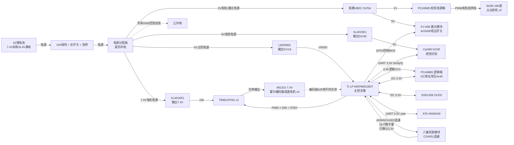

# 北邮 2026 电赛小车 V1 电路设计与采购清单

版本：V1.1 初版可搭建方案，按已确认器件修正灰度模块接法  
目标：优先完成基础分：自动巡迹、B 点定点作业、巡迹到靶位联动。  
控制原则：底盘巡迹不依赖视觉；`CanMV-K230` 只用于云台末端视觉校准。

---

## 1. 选型总览

| 子系统 | V1 商品名 | 关键参数/约束 |
| --- | --- | --- |
| 主控 | `TI LP-MSPM0G3507 LaunchPad` | TI MSPM0G3507，3.3V GPIO，80MHz Cortex-M0+，128KB Flash，32KB SRAM |
| 视觉 | `嘉楠 CanMV-K230 AI视觉开发板套件` | 5V 供电，外部 UART/GPIO 按 3.3V TTL 处理，串口 115200 8N1，套件需含摄像头 |
| 电机 | `MG310 7.4V 210RPM 霍尔编码器减速电机` | 4 个；额定 7.4V，建议 150-300RPM 区间，优先 210RPM/同批同速，AB 相霍尔编码器 |
| 电机驱动 | `TB6612FNG 双路直流电机驱动模块` | VM 4.5-13.5V，VCC 2.7-5.5V，约 1A 连续/3A 峰值每通道；V1 用 2 块 |
| 巡线 | `感为/同款 八路灰度巡线传感器 TTL输出版` | 5V 供电，`AD0/AD1/AD2` 选通 8 路，`OUT` 数字输出；已确认 OUT 高电平为 3.3V，可直连 M0 GPIO |
| 姿态 | `正点原子 ATK-MS901M 串口姿态传感器` | UART 输出 yaw，建议 115200，供电按模块丝印 3.3V/5V 选择 |
| 云台舵机 | `SG90 180度 9g位置舵机` | 4.8-6.0V，约 9g，塑料齿，180度位置控制，扭矩约 1.5-1.8kg·cm@4.8V |
| 舵机驱动 | `PCA9685 16路12位 PWM 舵机驱动模块` | I2C 地址常见 0x40，逻辑 VCC=3.3V，舵机 V+=5V |
| 作业端 | `KY-008 650nm 5V 激光发射模块` | 5V，建议 <=5mW，MOS 管低边开关控制 |
| 显示 | `0.96寸 SSD1306 I2C OLED 128x64` | I2C 地址常见 0x3C，3.3V 供电 |

> 采购时优先按上表的参数下单。MG310 这里按 `7.4V 额定` 修正；灰度模块 OUT 已确认 3.3V，暂不需要为灰度 OUT 加电平转换。MG310 编码器 AB 相到货后仍需实测输出电平，凡是输出到 M0 GPIO 的信号都按 `3.3V 安全输入` 处理。

---

## 2. 完整初版电路设计图

### 2.1 系统功能框图



信息流先按“主控 M0 是唯一决策中心”理解：灰度模块告诉 M0 小车相对黑线的位置；IMU 告诉 M0 当前航向；MG310 编码器告诉 M0 轮子实际转速；K230 只在到达作业区域后告诉 M0 目标在画面里的 `dx/dy/Q`。M0 再输出三类控制：给 TB6612 的底盘 PWM/方向，给 PCA9685 的云台角度，给 AO3400 的激光开关。

灰度模块不是 8 根 OUT 直连，而是 M0 先用 `AD0/AD1/AD2` 选择第几路，再读同一根 `OUT`。建议每次选通后延时 `50-100us` 再读，8 路扫完形成一个 8bit 灰度状态，每 `10-30ms` 更新一次巡线控制。

### 2.2 电源连接图

```text
BT1 2S锂电池 XT30
  + -> F1 10A保险 -> SW1总开关 -> ESTOP急停 -> PDB+
  - -------------------------------------------> PDB_GND

PDB+ -> DC1 XL4016E1 输入+      DC1 输出: 7.4V/8A  -> TB6612 VM
PDB+ -> DC2 UBEC 5V/5A 输入+    DC2 输出: 5.0V     -> PCA9685 V+ / 舵机 / 激光5V
PDB+ -> DC3 XL4015E1 输入+      DC3 输出: 5.0V/3A  -> CanMV-K230 5V
PDB+ -> DC4 LM2596S 输入+       DC4 输出: 5.0V/1A  -> LP-MSPM0G3507 VIN/5V

所有 DC 模块输入-、输出-、TB6612 GND、PCA9685 GND、K230 GND、M0 GND
均回到 PDB_GND，避免电机/舵机电流穿过 M0 板。
```

电机分支说明：MG310 按 7.4V 额定采购后，DC1 设为 `7.4V`。2S 锂电满电为 8.4V，理论上也可以直接接 TB6612 VM，但首版建议保留 XL4016E1 限压，满电阶段速度更可控；电池电压低于 7.4V 后，降压模块会接近直通，软件 PID 需要适应电压下降。

### 2.3 电源保护与滤波

| 位置 | 器件 | 参数 | 作用 |
| --- | --- | --- | --- |
| 电池正极后 | `汽车小号插片保险丝座` | 10A | 防短路烧线/烧电池 |
| 总入口 | `KCD1 船型开关` 或 `XT30 带开关线` | DC 10A 以上 | 总电源开关 |
| 电机/舵机前 | `蘑菇头急停开关` | 常闭，DC 5A 以上 | 优先切断电机与舵机分支 |
| DC1 输出 | 电解电容 | 1000uF/16V + 0.1uF | 电机电源抗冲击 |
| 每块 TB6612 VM-GND | 电解电容 | 470uF/16V + 0.1uF | 电机驱动局部去耦 |
| DC2 输出 | 电解电容 | 1000uF/16V + 0.1uF | 舵机瞬时电流缓冲 |
| DC3 输出 | 电解电容 | 470uF/16V + 0.1uF | K230 电源稳定 |
| DC4 输出 | 电解电容 | 220uF/16V + 0.1uF | 主控逻辑电源稳定 |

### 2.4 电机驱动连接

V1 使用 2 块 `TB6612FNG`，每个电机独占一个半桥通道。左侧两个电机共用同一组控制信号，右侧两个电机共用同一组控制信号。

| M0 逻辑信号 | 建议 M0 引脚 | 连接到 | 说明 |
| --- | --- | --- | --- |
| `PWM_L` | `PA12` | TB6612#1 `PWMA` + TB6612#2 `PWMA` | 左侧速度 |
| `L_IN1` | `PA8` | TB6612#1 `AIN1` + TB6612#2 `AIN1` | 左侧方向 |
| `L_IN2` | `PA27` | TB6612#1 `AIN2` + TB6612#2 `AIN2` | 左侧方向 |
| `PWM_R` | `PA13` | TB6612#1 `PWMB` + TB6612#2 `PWMB` | 右侧速度 |
| `R_IN1` | `PB0` | TB6612#1 `BIN1` + TB6612#2 `BIN1` | 右侧方向 |
| `R_IN2` | `PB6` | TB6612#1 `BIN2` + TB6612#2 `BIN2` | 右侧方向 |
| `MOTOR_STBY` | `PB18` | 两块 TB6612 `STBY` | 加 10k 上拉到 3.3V |

| TB6612 通道 | 电机 |
| --- | --- |
| TB6612#1 AOUT1/AOUT2 | 左前 MG310 |
| TB6612#1 BOUT1/BOUT2 | 右前 MG310 |
| TB6612#2 AOUT1/AOUT2 | 左后 MG310 |
| TB6612#2 BOUT1/BOUT2 | 右后 MG310 |

TB6612 `VCC` 接 M0 的 3.3V，`VM` 接 DC1 的 7.4V，`GND` 接公共地。

### 2.5 传感器与通信连接

| 模块 | M0 引脚建议 | 电气参数 | 备注 |
| --- | --- | --- | --- |
| 八路灰度 5V | DC4 5V 或稳定 5V 逻辑电源 | 5V 供电 | 不从 M0 3.3V 取电 |
| 八路灰度 GND | 公共地 | GND | 必须和 M0 共地 |
| 八路灰度 AD0 | `PB7` | M0 3.3V GPIO 输出 | 选通地址 bit0 |
| 八路灰度 AD1 | `PB8` | M0 3.3V GPIO 输出 | 选通地址 bit1 |
| 八路灰度 AD2 | `PA22` | M0 3.3V GPIO 输出 | 选通地址 bit2；到货/装车后确认 3.3V 能稳定选通 |
| 八路灰度 OUT | `PB4` | 3.3V TTL 输入 | 已确认 OUT 高电平 3.3V，可直连 M0；无需 SN74LVC245 |
| ATK-MS901M TX | `PA11 / M0_RX0` | UART 3.3V TTL | IMU TX -> M0 RX |
| ATK-MS901M RX | `PA10 / M0_TX0` | UART 3.3V TTL | M0 TX -> IMU RX |
| CanMV-K230 TX | `PA18 / M0_RX1` | UART 3.3V TTL | K230 TX -> M0 RX |
| CanMV-K230 RX | `PA17 / M0_TX1` | UART 3.3V TTL | M0 TX -> K230 RX；若 K230 只单向上报，可先不接 |
| OLED SDA | `PA28` | I2C 3.3V | 4.7k 上拉到 3.3V |
| OLED SCL | `PA31` | I2C 3.3V |  |
| PCA9685 SDA | `PA28` | I2C 3.3V | 和 OLED 共总线，地址 0x40 |
| PCA9685 SCL | `PA31` | I2C 3.3V |  |

K230 串口建议协议：

```text
$X:+012,Y:-008,Q:085#
```

含义：`X/Y` 为靶心相对画面中心的像素偏差，`Q` 为识别质量/置信度。M0 只在 `Q` 高于阈值时修正云台。

### 2.6 云台与作业端连接

| 器件 | 接法 | 参数 |
| --- | --- | --- |
| PCA9685 VCC | M0 3.3V | I2C 逻辑电源 |
| PCA9685 V+ | DC2 5V/5A | 舵机电源 |
| PCA9685 GND | 公共地 | 必须和 M0 共地 |
| 云台水平 SG90 | PCA9685 `CH0` | 50Hz，脉宽约 500-2500us，实际范围先用 1000-2000us 保守测试 |
| 云台俯仰 SG90 | PCA9685 `CH1` | 50Hz，脉宽约 500-2500us，实际范围先用 1000-2000us 保守测试 |
| 预留绘图/落笔舵机 | PCA9685 `CH2` | 可选 |
| KY-008 激光模块 + | DC2 5V | 5V 激光 |
| KY-008 激光模块 - | AO3400 漏极 | N-MOS 低边开关 |
| AO3400 源极 | GND |  |
| AO3400 栅极 | M0 GPIO，经 100Ω 串联 | 栅极 100k 下拉到 GND |

### 2.7 声光、按键、调试口

| 功能 | 商品/器件 | 建议接法 |
| --- | --- | --- |
| 蜂鸣器 | `5V 有源蜂鸣器模块` | M0 GPIO -> S8050/AO3400 -> 蜂鸣器；不要 GPIO 直推 |
| 指示灯 | `5mm LED 红绿蓝` | M0 GPIO -> 330Ω -> LED -> GND |
| 按键 | `6x6x5mm 轻触按键` | 一端 GND，一端 M0 GPIO，启用内部上拉 |
| 调试串口 | `CH340 USB转TTL模块` | 3.3V 档，接备用 UART 或临时接 K230 UART |
| 下载调试 | LP-MSPM0G3507 板载 XDS | 保留 USB 调试口可插拔 |

### 2.8 到货后必须确认的电气点

| 器件 | 必须确认 | 操作方法 | 通过标准 |
| --- | --- | --- | --- |
| MG310 7.4V 霍尔编码器电机 | 线序、电机正反、编码器供电、电机空载电流、堵转/启动电流、AB 相输出电平、每圈脉冲数 | 先只接一个电机；电机线接 TB6612，编码器 VCC/GND 单独接 3.3V 或商家指定电压；万用表测 AB 高电平，低速转动看跳变 | AB 高电平不超过 3.3V 才能直连 M0；若是 5V，AB 进 SN74LVC245 后再进 M0 |
| TB6612FNG D153C | 板子版本、STBY 是否上拉、芯片发热 | 单电机悬空低速跑 30s，再落地低速跑 30s | 芯片不烫手、不复位；STBY 由 M0 控制，默认可拉高 |
| PCA9685 模块 | `VCC` 和 `V+` 是否分离、I2C 地址、板载上拉接到哪里 | 只接 VCC=3.3V/GND/SDA/SCL，不接舵机，先 I2C 扫描；再接 V+=5V 和一个 SG90 | I2C 扫到 `0x40`；舵机不从 M0 取电 |
| SG90 180度舵机 | 实际安全机械角度、是否买成连续旋转版 | PCA9685 50Hz，从 1500us 中位开始，小步扫 1000-2000us | 会按角度定位且不持续空转；装云台后不顶死 |
| CanMV-K230 | 5V 输入口、UART 引脚、波特率、TX 高电平 | 先 USB 上电跑 CanMV IDE；CH340 3.3V 档接 K230 UART 做发送测试，再接 M0 | K230 TX 高电平约 3.3V；M0 能收到 `$X:+000,Y:+000,Q:100#` |
| 降压模块/UBEC | 输出电压、正负极、纹波导致的重启问题 | 不接负载先用万用表调压；接假负载或单模块复测 | 电机 7.4V，舵机/K230/M0 分支均为 5.0V，正负极无误 |
| SN74LVC245 成品模块 | 方向、OE 使能、A/B 两侧供电 | 到货先用 5V/3.3V 和跳线做单路电平转换测试 | 5V 输入能稳定变成 3.3V 输出；只用于编码器等 5V 信号 |

---

## 3. V1 采购清单

### 3.1 核心电子模块

| 优先级 | 商品名/搜索关键词 | 参数要求 | 数量 | 备注 |
| --- | --- | --- | ---: | --- |
| 必买 | `TI LP-MSPM0G3507 LaunchPad 开发板` | MSPM0G3507，3.3V GPIO | 1 | 主控 |
| 必买 | `嘉楠 CanMV-K230 AI视觉开发板套件 含摄像头` | 5V 供电，3.3V UART，带摄像头和排针 | 1 | 视觉只用于云台校准 |
| 必买 | `MG310 7.4V 210RPM 霍尔编码器减速电机` | 7.4V，约 210RPM，AB 相霍尔编码器 | 4+1 | 1 个备用；同批次同参数；若只有 260/300RPM，同批一致并软件限速 |
| 必买 | `TB6612FNG 双路电机驱动模块` | VM 4.5-13.5V，VCC 2.7-5.5V，1A 连续/3A 峰值 | 2+1 | 2 块上车，1 块备用 |
| 必买 | `感为 八路灰度传感器 TTL输出版` | 5V 供电，AD0/AD1/AD2 三线选通，OUT 数字输出，OUT 已实测 3.3V | 1+1 | 不是 8 路 OUT 直连；M0 轮询读取 |
| 必买 | `正点原子 ATK-MS901M 串口姿态传感器` | UART，115200，输出 yaw/姿态角 | 1 | 断路/虚线段航向控制 |
| 必买 | `PCA9685 16路12位 PWM 舵机驱动模块` | I2C，VCC 3.3V，V+ 5V，16 路舵机 | 1 | 云台、落笔机构 |
| 必买 | `SG90 180度 9g位置舵机` | 4.8-6V，约 9g，塑料齿，180度位置控制 | 2+1 | 云台用，1 个备用；不要买 360度/连续旋转版 |
| 必买 | `KY-008 650nm 5V 激光发射模块` | 5V，<=5mW | 1+1 | 先做指向 |
| 建议 | `0.96寸 SSD1306 I2C OLED 128x64` | I2C，0x3C，3.3V | 1 | 显示模式/参数 |
| 建议 | `CH340 USB转TTL模块 3.3V/5V可选` | 3.3V 串口 | 1 | 调 K230/M0 串口 |

### 3.2 电源与保护

| 优先级 | 商品名/搜索关键词 | 参数要求 | 数量 | 备注 |
| --- | --- | --- | ---: | --- |
| 必买 | `2S 7.4V 2200mAh 25C XT30 锂电池` | 2S，1500-2200mAh，25C 以上，XT30 | 2 | 一块使用，一块充电 |
| 必买 | `2S 锂电池平衡充电器` | 支持 2S 平衡充 | 1 | 例如 B3/B6 类 |
| 必买 | `XL4016E1 8A/10A 可调降压模块` | 输入 6-32V，输出调 7.4V，8A 级 | 1 | 电机分支；满电限压，低电压时接近直通 |
| 必买 | `航模 UBEC 5V 5A 降压模块` | 输入 2S/3S，输出 5V/5A | 1 | 舵机分支，抗瞬态好 |
| 必买 | `XL4015E1 5A 可调降压模块` | 输入 5-32V，输出调 5.0V，3A 以上 | 1 | K230 分支 |
| 必买 | `LM2596S DC-DC 降压模块` | 输入 4-35V，输出调 5.0V，1A 以上 | 1 | M0/逻辑分支 |
| 必买 | `XT30 公母插头带线` | 30A 级 | 3 套 | 电池、电源入口 |
| 必买 | `汽车小号插片保险丝座 + 10A保险片` | 10A | 1 套 | 电池正极后 |
| 必买 | `蘑菇头急停开关 常闭型` | DC 5A 以上 | 1 | 切电机/舵机分支 |
| 必买 | `KCD1 船型开关` | DC 5A 以上，或买更高规格 | 1 | 总开关 |
| 必买 | `洞洞板/电源分配板` | 5x7cm 以上 | 2 | 配电和小电路 |

### 3.3 分立器件与连接器

| 优先级 | 商品名/搜索关键词 | 参数要求 | 数量 | 备注 |
| --- | --- | --- | ---: | --- |
| 必买 | `SN74LVC245A 8路电平转换成品模块/已焊排针模块` | 5V 输入转 3.3V 输出，优先成品模块 | 1 | 灰度 OUT 已确认 3.3V，主要预留给 MG310 编码器 AB 相或其他 5V 输出信号 |
| 必买 | `AO3400A N沟道MOS管 SOT-23` | 逻辑电平 MOS | 10 | 激光、蜂鸣器、小负载 |
| 建议 | `S8050 NPN三极管` | TO-92 | 10 | 蜂鸣器/LED 驱动备用 |
| 必买 | `电阻包 330Ω/1k/10k/100k` | 1/4W | 各 20 | LED、限流、上拉下拉 |
| 必买 | `电解电容 1000uF 16V` | 低 ESR 更好 | 5 | 电机/舵机电源 |
| 必买 | `电解电容 470uF 16V` | 低 ESR 更好 | 5 | 驱动/K230 |
| 必买 | `0.1uF 陶瓷电容 50V` | 104 | 20 | 局部去耦 |
| 必买 | `XH2.54 2P/3P/4P 端子线套装` | 公母头 + 端子 | 1 套 | 模块连接 |
| 必买 | `杜邦线 公对母/母对母` | 20cm | 若干 | 临时调试 |
| 必买 | `硅胶线 18AWG 红黑` | 电源线 | 2m | 电池、电机电源 |
| 必买 | `硅胶线 22AWG 红黑黄` | 信号线 | 5m | 传感器/舵机 |
| 建议 | `热缩管 2/3/5mm 套装` | 绝缘 | 1 套 | 线束整理 |
| 建议 | `尼龙扎带 2.5x100mm` | 固线 | 1 包 | 工程完善度 |

### 3.4 结构与机械

| 优先级 | 商品名/搜索关键词 | 参数要求 | 数量 | 备注 |
| --- | --- | --- | ---: | --- |
| 必买 | `亚克力小车底盘板/碳纤维板/3D打印底盘` | 整车不超过 25 x 15 x 25cm | 1 | 推荐自制双层板 |
| 必买 | `MG310 电机固定支架` | 匹配 MG310 | 4 |  |
| 必买 | `60mm/65mm 小车轮 D轴轮` | 匹配 MG310 输出轴 | 4+1 | 轮径一致 |
| 必买 | `万向轮/牛眼轮` | 低摩擦 | 1-2 | 四轮驱可不装，调试可备用 |
| 必买 | `M3 铜柱套装` | 6/10/15/20mm | 1 套 | 双层结构 |
| 必买 | `M3 螺丝螺母垫片套装` | M3 | 1 套 | 结构固定 |
| 必买 | `SG90 二自由度云台支架套件 9g舵机云台` | 轻量，适配 SG90/9g 舵机 | 1 | 只安装摄像头小模组和激光，K230 主板不要放上云台 |
| 建议 | `可调摄像头支架/小云台夹具` | 轻量 | 1 | 让 K230 摄像头与激光固定 |

### 3.5 场地与靶标

| 优先级 | 商品名/搜索关键词 | 参数要求 | 数量 | 备注 |
| --- | --- | --- | ---: | --- |
| 必买 | `白色哑光 PVC板/KT板` | 总面积不少于 220 x 120cm | 1 套 | 可拼接，接缝压平 |
| 必买 | `18mm 黑色哑光电工胶带/美纹黑胶带` | 宽度 18mm | 3 卷 | 赛道线宽 1.8cm ±0.2cm |
| 必买 | `A4 白纸/硬卡纸` | A4 | 20 张 | 靶纸 |
| 必买 | `泡沫板/硬纸板靶架` | 高度不大于 50cm | 1 套 | 靶面与 AB 平行 |
| 必买 | `靶心贴纸/黑色马克笔/圆规` | 同心圆 | 1 套 | 视觉识别靶心 |
| 必买 | `卷尺 3m` | 1mm 刻度 | 1 | 量场地 |
| 必买 | `长直尺 1m` | 画直线 | 1 |  |
| 建议 | `细线 + 图钉/吸盘` | 画半圆弧 | 1 套 | 替代大圆规 |

### 3.6 必要工具

| 优先级 | 商品名/搜索关键词 | 参数要求 | 数量 | 备注 |
| --- | --- | --- | ---: | --- |
| 必买 | `可调温电烙铁套装` | 60W 以上 | 1 | 焊排针/电源线 |
| 必买 | `焊锡丝 + 助焊剂` | 0.8mm 焊锡丝 | 1 套 |  |
| 必买 | `数字万用表` | 测电压/通断 | 1 | 上电前必测短路 |
| 必买 | `剥线钳` | 0.5-2.5mm² | 1 | 做线 |
| 必买 | `斜口钳/尖嘴钳` | 小型电子工具 | 1 套 |  |
| 必买 | `热熔胶枪` | 小号即可 | 1 | 固线、临时固定 |
| 必买 | `螺丝刀/内六角套装` | M2/M3 | 1 套 | 机械装配 |
| 必买 | `Type-C 数据线` | 支持数据 | 2 | M0/K230 调试 |
| 建议 | `锂电池防爆袋` | 2S 电池充电 | 1 | 充电安全 |

### 3.7 非必要，能借就借

| 物品 | 为什么不优先买 |
| --- | --- |
| 示波器 | 串口/PWM 问题严重时再借 |
| 逻辑分析仪 | 有助于查 UART/I2C，但不是第一天必需 |
| 可调稳压电源 | 调电机和舵机很好用，能借最好 |
| 激光切割服务 | 底盘可先用亚克力手工打孔/3D 打印 |
| 高级相机/补光灯 | 手机录像和普通台灯先够用 |

---

## 4. 上电检查流程

1. 不插 M0、不插 K230、不插 TB6612，先调 4 路降压输出：`7.4V`、`5.0V`、`5.0V`、`5.0V`。
2. 万用表测公共地是否连通，确认电源正负没有短路。
3. 只接 M0 和 OLED，确认 3.3V 正常。
4. 接灰度模块，M0 依次输出 AD0/AD1/AD2 选通 0-7 路，确认 OUT 读数随黑白变化。
5. 接 IMU，确认 UART yaw 输出。
6. 接 TB6612 和一个电机低速测试，再接四个电机。
7. 接 PCA9685 和一个舵机测试，再接云台两个舵机。
8. 接 K230 UART，先只发测试帧 `$X:+000,Y:+000,Q:100#`。
9. 最后接激光模块，低功率短时测试。

### 4.1 未到货期间的操作顺序

1. 先在 MSPM0 工程里写灰度轮询函数：`AD0/AD1/AD2` 输出 0-7，延时 `50-100us`，读 `OUT`，拼成 8bit 状态，通过串口或 OLED 打印。
2. 写 K230 串口假数据接收解析：先不用真 K230，用 CH340 或 M0 自发测试帧 `$X:+000,Y:+000,Q:100#`，确认 M0 能解析 `X/Y/Q`。
3. 写 PCA9685 驱动接口占位：`servo_set_us(channel, pulse_us)`，先按 `1000-2000us` 限幅，等模块到货后直接测一个 SG90。
4. 画并贴线标：电池、7.4V 电机、5V 舵机、5V K230、5V M0、3.3V I2C/UART、GND。所有红黑线先按分支分好，别等装车时临时认线。
5. 搭一个最小测试场：白底板 + 18mm 黑胶带直线、T 字、弯道各一段，用来调灰度阈值和巡线 PID。

---

## 5. V1 风险清单

- `M0 GPIO` 不能直接接 5V TTL 输出。灰度 OUT 已确认 3.3V，可直连；MG310 编码器 AB 相还没到货实测，若是 5V 输出，必须加 `SN74LVC245A` 成品电平转换模块。
- `舵机/K230/电机` 不能从 M0 板载 5V/3.3V 取电。
- `MG310` 按 7.4V 额定采购；不要再买 6V 版，否则满电 2S 或 7.4V 电机分支会偏压使用。
- `TB6612` 驱动 7.4V MG310 时电压范围够，但电流余量偏紧；发热明显、起步无力或重启时，立即降速、降低加速度，或换更大电流驱动，例如 `DRV8871/DRV8833 大电流版/BTS7960`。
- `K230` 和 `M0` 串口必须共地；TX/RX 交叉。
- `SG90` 是轻载塑料齿舵机，只适合带摄像头小模组和激光模块；不要把 K230 主板、电池或重支架装到云台上。
- 线束要固定，云台处要留柔性余量，避免转动时拉断摄像头/激光线。
- 比赛报告中必须说明：视觉只用于云台末端校准，底盘巡迹不依赖视觉。
