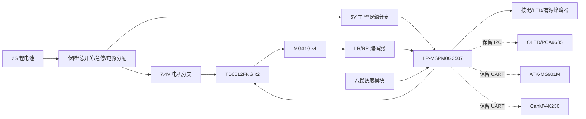

# 北邮2026电赛小车循迹架构、引脚接线与信息流 V1

适用范围：只考虑底盘循迹与声光交互；暂不接入云台、激光、K230 视觉闭环。主控固定为 `TI LP-MSPM0G3507 LaunchPad`。底盘行驶不依赖摄像头，符合题目“无摄像头条件下完成路径识别”的要求。

## 1. 总体架构

循迹闭环分三层：

1. 灰度闭环：八路灰度模块每 `10ms` 扫描一次，得到黑线相对车头中心的横向误差，PD 控制输出左右轮差速。
2. IMU 航向保持：进入虚线/无黑线直线段时，记录最后一次正常压线时的 yaw；短时间丢线后按 yaw 误差修正左右轮，让车沿进入缺线前的方向直走。
3. 里程事件层：LR/RR 后轮编码器累计里程，到达预设的 `B/C/D/A` 里程阈值时触发声光提示或停车。因为黑线等宽，不能靠“宽黑区/标记区”识别关键点。

## 2. 引脚分配

### 已用引脚

| 功能 | M0 引脚 | 连接对象 | 说明 |
| --- | --- | --- | --- |
| `PWM_L` | `PA12 / TIMG0_C0` | 两块 TB6612 `PWMA` | 左侧 LF/LR 同速 |
| `PWM_R` | `PA13 / TIMG0_C1` | 两块 TB6612 `PWMB` | 右侧 RF/RR 同速 |
| `L_IN1` | `PA8` | 两块 TB6612 `AIN1` | 左侧方向 |
| `L_IN2` | `PA27` | 两块 TB6612 `AIN2` | 左侧方向 |
| `R_IN1` | `PB0` | 两块 TB6612 `BIN1` | 右侧方向 |
| `R_IN2` | `PB6` | 两块 TB6612 `BIN2` | 右侧方向 |
| `MOTOR_STBY` | `PB18` | 两块 TB6612 `STBY` | 建议另加 10k 上拉到 3.3V |
| `GRAY_AD0` | `PB7` | 灰度模块 `AD0` | 选通 bit0 |
| `GRAY_AD1` | `PB8` | 灰度模块 `AD1` | 选通 bit1 |
| `GRAY_AD2` | `PA22` | 灰度模块 `AD2` | 选通 bit2 |
| `GRAY_OUT` | `PB4` | 灰度模块 `OUT` | 已确认高电平 3.3V，可直连 |
| `LR_ENC_A` | `PB19` | 左后 MG310 编码器 A | A 双边沿计数 |
| `LR_ENC_B` | `PB24` | 左后 MG310 编码器 B | 判方向 |
| `RR_ENC_A` | `PA26` | 右后 MG310 编码器 A | A 双边沿计数 |
| `RR_ENC_B` | `PA25` | 右后 MG310 编码器 B | 判方向 |
| `IMU_TX` | `PA10 / UART0_TX` | ATK-MS901M `RX` | 可先不接，保留配置指令 |
| `IMU_RX` | `PA11 / UART0_RX` | ATK-MS901M `TX` | 115200 8N1，读取 yaw |
| `START_KEY` | `PB2` | 轻触按键到 GND | 内部上拉，低电平按下 |
| `BEEP` | `PB13` | AO3400/S8050 -> 5V 有源蜂鸣器 | GPIO 不直推蜂鸣器 |
| `LED_R` | `PA9` | 330R -> 红 LED -> GND | 状态灯 |
| `LED_G` | `PA15` | 330R -> 绿 LED -> GND | 状态灯 |

### 保留给云台、视觉和调试的引脚

| 预留功能 | M0 引脚 | 说明 |
| --- | --- | --- |
| `I2C_SDA` | `PA28` | OLED 和 PCA9685 共总线 |
| `I2C_SCL` | `PA31` | OLED 和 PCA9685 共总线 |
| `K230_TX/RX` | `PA17 / PA18` | K230 串口，115200 8N1 |
| `LASER_SW` | `PB15` | 后续 KY-008 MOS 开关，当前程序不使用 |

## 3. 面包板接线

面包板只放低电流逻辑与小信号，电机电源和电机线不要走面包板。

| 面包板区域 | 接线 |
| --- | --- |
| 红色电源轨 | M0 `3V3`，只给 TB6612 `VCC`、编码器 VCC、上拉逻辑使用 |
| 蓝色地轨 | 公共 GND，连接 M0 GND、灰度 GND、TB6612 GND、编码器 GND、蜂鸣器驱动 GND |
| 5V 逻辑轨 | LM2596 5V，可给灰度模块 5V；不要接到 M0 GPIO |
| 灰度排线 | `5V/GND/AD0/AD1/AD2/OUT` 先插到面包板，再杜邦线到 M0 |
| 声光区 | LED 串 `330R`；蜂鸣器用 AO3400 或 S8050 低边驱动，并给栅极/基极限流和下拉 |
| 编码器区 | LR/RR 编码器先接 3.3V 供电，A/B 直连 M0；若 3.3V 供电不能工作，再改 5V + SN74LVC245 |

电机功率接线：

| TB6612 通道 | 电机 |
| --- | --- |
| TB6612#1 `AOUT1/AOUT2` | `LF` 左前 |
| TB6612#1 `BOUT1/BOUT2` | `RF` 右前 |
| TB6612#2 `AOUT1/AOUT2` | `LR` 左后 |
| TB6612#2 `BOUT1/BOUT2` | `RR` 右后 |

两块 TB6612 的 `VM` 接 7.4V 电机分支，`VCC` 接 3.3V，`GND` 回公共地。左侧两路共用 `PWM_L/L_IN1/L_IN2`，右侧两路共用 `PWM_R/R_IN1/R_IN2`。

## 4. 信息流

1. 灰度模块扫描：M0 输出 `AD2 AD1 AD0 = 000..111`，每路等待约 `80us` 后读取 `OUT`，形成 `8bit` 黑线状态。
2. 误差计算：把 8 个传感器映射为 `-3500` 到 `+3500` 的位置权重，黑线在左为负，黑线在右为正。
3. PD 控制：`correction = Kp * error + Kd * (error - last_error)`，正误差表示线在右侧，小车需要右转，所以左轮加速、右轮减速。
4. IMU 缺线直行：灰度看到线时持续刷新 `hold_yaw`；灰度短时间看不到线时，使用 `hold_yaw - current_yaw` 做航向 P 控制，让小车沿虚线/无黑线直线段继续向前。
5. 电机输出：控制结果被限幅到安全 PWM 范围，再转换成 TB6612 的方向脚和 20kHz PWM。
6. 编码器累计：LR/RR 的 A 相双边沿中断计数，读取 B 相判方向，左右后轮平均值换算为行驶里程。
7. 关键点事件：里程超过 `B/C/D/A` 的标定阈值时，蜂鸣器短鸣、LED 闪烁；到 A 点终点停车并长鸣。
8. 失线保护：若 IMU 数据过期或缺线太久，先按最后误差方向低速搜索；超过更长时间仍找不到线则停车报警。

## 5. 关键点标定方法

黑线等宽时不要使用“宽黑区/全黑区”判点。建议这样标定：

1. 把车头放在 A 点，编码器清零。
2. 低速巡线到 B 点，人工按停或观察视频，记录此时平均编码器计数或里程，填入 `BOARD_KEYPOINT_DISTANCE_MM[0]`。
3. 继续记录 C、D、回到 A 的累计里程，填入 `BOARD_KEYPOINT_DISTANCE_MM[1..3]`。
4. 如果打滑明显，用 IMU 的 yaw 区间作为辅助校验，例如接近 B 点里程且航向在预期范围内才触发。
5. 每次更换轮胎、电池电压、赛道尺寸或车速后，重新跑一次低速标定。

## 6. IMU 使用策略

IMU 不替代灰度传感器，而是补足虚线/无黑线直线段：

1. 有黑线时：灰度 PD 是主控制，IMU 只记录当前 yaw 作为缺线段参考。
2. 短缺线时：如果 `ATK-MS901M` yaw 数据仍新鲜，使用航向保持控制；这比继续套用最后一次灰度误差稳定。
3. 长缺线时：进入低速搜索，仍找不到线则停车并声光报警。
4. 关键点识别：优先用编码器累计里程，IMU 只做可选航向校验，避免轮胎轻微打滑导致误判。

## 7. CCS 程序位置

工程目录：`ecar_line_following_ccs`

主要文件：

| 文件 | 作用 |
| --- | --- |
| `src/board_pins.h` | 所有引脚宏和可调硬件参数 |
| `src/motor.c/.h` | TB6612 差速驱动 |
| `src/grayscale.c/.h` | 八路灰度选通扫描和误差计算 |
| `src/encoder.c/.h` | LR/RR 编码器计数与里程换算 |
| `src/imu.c/.h` | ATK-MS901M/JY901 风格 yaw 帧解析和航向误差 |
| `src/line_controller.c/.h` | 灰度 PD 循迹控制 |
| `src/ui.c/.h` | 按键、LED、蜂鸣器 |
| `src/main.c` | 启停状态机、巡线、关键点事件 |

初次上车时把 `BOARD_MOTOR_START_PERCENT` 设为 `10-12`，确认方向后再逐步提高。若车向黑线相反方向修正，先检查灰度左右方向；若只有某侧电机反向，优先交换该侧电机线或改 `BOARD_MOTOR_LEFT_INVERT/BOARD_MOTOR_RIGHT_INVERT`。

## 8. 首次上车联调与自检

当前 `ecar_line_following_ccs` 的 `main.c` 已内置一套不依赖串口的联调模式，适合第一次接完线后直接上电排查：

1. 短按 `START_KEY(PB2)`：在 `IDLE / FINISHED / ERROR` 进入循迹运行；运行中再短按则停车回 `IDLE`。
2. 长按 `START_KEY(PB2)` 超过 `800ms`：在 `IDLE / FINISHED / ERROR` 进入 `SELFTEST`；自检中短按或长按都退出回 `IDLE`。
3. 自检开始后先静止约 `1.5s`，随后左侧电机低速转 `700ms`，停顿，再右侧电机低速转 `700ms`，循环往复。
4. 自检时 `绿灯亮` 表示灰度当前看到了黑线，`红灯亮` 表示 IMU 的 yaw 数据在 `300ms` 内有效。
5. 左侧点动结束后如果 `LR` 后轮编码器计数变化足够，蜂鸣器短鸣；右侧点动结束后如果 `RR` 编码器计数变化足够，蜂鸣器稍长短鸣；若某一侧转了但编码器计数增量不足 `4`，则会长鸣提示排查。
6. 自检阶段务必让四个车轮悬空。若某一侧方向反了，优先交换该侧电机两根电机线，其次再改 `BOARD_MOTOR_LEFT_INVERT / BOARD_MOTOR_RIGHT_INVERT`。

## 9. 最先要调的参数

第一次落地时优先只调下面这些宏，不要一开始到处改：

1. `BOARD_GRAY_BLACK_IS_HIGH`：如果白底黑线读出来的逻辑反了，就先改它。
2. `BOARD_MOTOR_START_PERCENT`：首轮建议 `10-12`，确认不会闯线再慢慢加。
3. `BOARD_LINE_KP / BOARD_LINE_KD`：先让直线稳定，再去提弯道速度。
4. `BOARD_HEADING_KP`：只影响无黑线直线段的 IMU 保向，不影响正常压线时的灰度主闭环。
5. `BOARD_LOST_HEADING_HOLD_MS`：如果赛道虚线段更长，可适当增加；若容易在岔弯处误保向，则适当减小。
6. `BOARD_KEYPOINT_DISTANCE_MM[4]`：低速标定完 A-B-C-D-A 里程后再填写，不要先拍脑袋写死。
