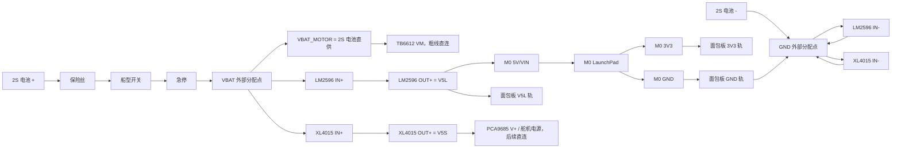

# 北邮2026电赛小车 面包板接线方案 架构不变 V1

本文件是在 `线路原理图_洞洞板架构_V1` 基础上的实现方式变更：**不用洞洞板/PCB 转接板，改用面包板做低电流信号转接**。

不变的内容：

- 主控仍为 `TI LP-MSPM0G3507 LaunchPad`
- M0 引脚分配不变
- 电源分工更新为：电机由 2S 电池直供，`LM2596` 供主控逻辑，`XL4015` 供后续云台舵机
- `XL4016` 本版空置不用，不接输入也不接输出
- 循迹、IMU、声光、编码器、云台/视觉预留网络名不变

变化的内容：

- 面包板只承担 `3V3 / V5L / GND` 小电流分配和信号跳线
- `VBAT / VBAT_MOTOR / V5S / 电机线 / 舵机电源线` 不走面包板长电源轨
- 电池、急停、两个 5V 稳压模块、TB6612 电机功率线用外部接线端子、焊接分线点或粗线直连

---

## 1. 面包板角色

面包板可以接：

- `M0` 到 TB6612 的逻辑控制线
- 灰度模块、编码器、IMU、按键、LED、蜂鸣器
- `3V3` 小电流逻辑轨
- `V5L` 灰度/主控 5V 逻辑轨
- `GND` 公共地信号轨

面包板不要接：

- 电池正极 `VBAT` 主线
- `VBAT_MOTOR` 到电机驱动的主电流长线
- 四个电机输出线
- `XL4015 OUT+ V5S` 舵机大电流长线
- 舵机电源主线

一句话：**面包板当信号转接板，不当功率分配板。**

---

## 2. 电源总架构



### 2.1 电源固定分工

| 来源/模块 | 输出 | 网络名 | 供电对象 |
| --- | ---: | --- | --- |
| 2S 电池，急停后 | `6.0V-8.4V` | `VBAT_MOTOR` | 两块 TB6612 `VM`、四个电机 |
| `LM2596` | `5.0V` | `V5L` | M0 `5V/VIN`、面包板 `V5L`、灰度模块 |
| `XL4015` | `5.0V` | `V5S` | 后续 PCA9685 `V+`、舵机、激光预留 |

说明：2S 锂电满电是 `8.4V`，不是固定 `7.4V`。TB6612 的 `VM` 可以接这一路，但首次测试必须低 PWM、车轮悬空，避免满电时电机过猛。

禁止：

```text
V5L 不接 V5S
V5L 不接 3V3
V5S 不接 M0 5V/VIN
VBAT_MOTOR 不上面包板电源轨
电机输出线不上面包板长孔排
```

---

## 3. 面包板电源轨分配

以常见全尺寸面包板为例：

| 面包板轨道 | 网络 | 来源 | 用途 |
| --- | --- | --- | --- |
| 上红轨 | `3V3` | M0 `3V3` | TB6612 `VCC`、编码器、IMU、蜂鸣器模块、I2C 逻辑 |
| 上蓝轨 | `GND` | 外部 `GND` + M0 `GND` | 所有低电流模块地 |
| 下红轨 | `V5L` | LM2596 `OUT+` | 灰度模块 5V、必要的逻辑 5V |
| 下蓝轨 | `GND` | 外部 `GND` | 与上蓝轨相连 |

如果面包板电源轨中间断开，必须同名跨接：

```text
上红左段 -> 上红右段：3V3
上蓝左段 -> 上蓝右段：GND
下红左段 -> 下红右段：V5L
下蓝左段 -> 下蓝右段：GND
上蓝 GND -> 下蓝 GND
```

不要跨接：

```text
上红 3V3 不接 下红 V5L
V5S 不接面包板红轨
VBAT_MOTOR 不接面包板红轨
```

## 3A. 常见面包板布局图

本图按市场最常见的 `830 孔全尺寸面包板` 来画：

- 中间插孔：`A-E` 为一组、`F-J` 为一组，同一列 5 个孔内部相通。
- 中间沟槽：`E` 和 `F` 不相通。
- 电源轨：上方两条、下方两条；很多面包板电源轨中间断开，需要用短跳线跨接。
- 坐标写法：`A01` 表示 A 行第 1 列，`J63` 表示 J 行第 63 列。

### 3A.1 符号图例

| 符号 | 含义 |
| --- | --- |
| `+` | 上红轨 `3V3` |
| `-` | 上/下蓝轨 `GND` |
| `5` | 下红轨 `V5L` |
| `T` | TB6612 逻辑并线区 |
| `G` | 灰度模块接口 |
| `E` | 编码器接口 |
| `U` | IMU 接口 |
| `I` | I2C 预留接口 |
| `K` | K230 UART 预留 |
| `L` | 激光控制预留 |
| `S` | 启动按键 |
| `B` | MH-FMD 蜂鸣器 |
| `R` | LED 限流电阻 |
| `D` | LED |
| `C` | 去耦电容 |
| `M` | 来自 M0 的杜邦线 |
| `·` | 空孔 |

### 3A.2 面包板总图

下面这张是功能区布局图，不表示每个小孔都必须插元件，但每个模块的列号要按后面的坐标表执行。

```text
常见 830 孔面包板俯视图

      C01-C07        C10-C15        C18-C26        C29-C38        C41-C46        C50-C63
      TB6612         灰度           编码器          IMU/I2C        预留串口/激光    声光/按键

上红轨  +3V3  + + + + + + + + + + + + + + + + + + + + + + + + + + + + + +  ||  + + + + + + + + + + + + + + + + + + + + + + + + + + + + + + +
上蓝轨  GND   - - - - - - - - - - - - - - - - - - - - - - - - - - - - - -  ||  - - - - - - - - - - - - - - - - - - - - - - - - - - - - - - -

        01 02 03 04 05 06 07 08 09 10 11 12 13 14 15 16 17 18 19 20 21 22 23 24 25 26 27 28 29 30 31 32 33 34 35 36 37 38 39 40 41 42 43 44 45 46 47 48 49 50 51 52 53 54 55 56 57 58 59 60 61 62 63
A 行   T  T  T  T  T  T  T  ·  ·  G  G  G  G  G  G  ·  ·  E  E  E  E  ·  E  E  E  E  ·  ·  U  U  U  U  ·  ·  I  I  I  I  ·  ·  K  K  K  ·  ·  L  ·  ·  ·  S  ·  ·  ·  B  B  B  ·  R  R  D  R  R  D
B 行   T  T  T  T  T  T  T  ·  ·  G  G  G  G  G  G  ·  ·  E  E  E  E  ·  E  E  E  E  ·  ·  U  U  U  U  ·  ·  I  I  I  I  ·  ·  K  K  K  ·  ·  L  ·  ·  ·  S  ·  ·  ·  B  B  B  ·  R  R  D  R  R  D
C 行   M  M  M  M  M  M  M  ·  ·  5  -  M  M  M  M  ·  ·  +  -  M  M  ·  +  -  M  M  ·  ·  +  -  M  M  ·  ·  +  -  M  M  ·  ·  -  M  M  ·  ·  M  ·  ·  ·  M  -  ·  ·  +  -  M  ·  M  R  -  M  R  -
D 行   ·  ·  ·  ·  ·  ·  R  ·  ·  C  C  ·  ·  ·  ·  ·  ·  ·  ·  ·  ·  ·  ·  ·  ·  ·  ·  ·  ·  ·  ·  ·  ·  ·  ·  ·  ·  ·  ·  ·  ·  ·  ·  ·  ·  ·  ·  ·  ·  S  -  ·  ·  B  B  B  ·  ·  D  -  ·  D  -
E 行   ·  ·  ·  ·  ·  ·  R  ·  ·  C  C  ·  ·  ·  ·  ·  ·  ·  ·  ·  ·  ·  ·  ·  ·  ·  ·  ·  ·  ·  ·  ·  ·  ·  ·  ·  ·  ·  ·  ·  ·  ·  ·  ·  ·  ·  ·  ·  ·  S  -  ·  ·  B  B  B  ·  ·  D  -  ·  D  -

                       ─────────────── 中央隔槽：A-E 与 F-J 不相通 ───────────────

F-J 行建议留空作为临时测试孔、串口调试孔或后续云台/视觉临时跳线区。

下红轨  V5L   5 5 5 5 5 5 5 5 5 5 5 5 5 5 5 5 5 5 5 5 5 5 5 5 5 5 5 5 5 5  ||  5 5 5 5 5 5 5 5 5 5 5 5 5 5 5 5 5 5 5 5 5 5 5 5 5 5 5 5 5 5 5
下蓝轨  GND   - - - - - - - - - - - - - - - - - - - - - - - - - - - - - -  ||  - - - - - - - - - - - - - - - - - - - - - - - - - - - - - - -
```

图中 `||` 表示很多面包板电源轨中间可能断开。实际接线时要用短跳线把同名轨跨接：

```text
上红轨左段 3V3 -> 上红轨右段 3V3
上蓝轨左段 GND -> 上蓝轨右段 GND
下红轨左段 V5L -> 下红轨右段 V5L
下蓝轨左段 GND -> 下蓝轨右段 GND
上蓝轨 GND     -> 下蓝轨 GND
```

### 3A.3 各列功能定义

#### TB6612 逻辑并线区：C01-C07

`A/B/C/D/E` 同一列内部相通，所以同一个网络直接插同一列即可，不需要焊锡桥。

| 列 | 网络 | 插线方式 |
| ---: | --- | --- |
| `C01` | `PWM_L` | `M0 PA12`、`U4 PWMA`、`U5 PWMA` 都插本列 |
| `C02` | `PWM_R` | `M0 PA13`、`U4 PWMB`、`U5 PWMB` 都插本列 |
| `C03` | `L_IN1` | `M0 PA8`、`U4 AIN1`、`U5 AIN1` 都插本列 |
| `C04` | `L_IN2` | `M0 PA27`、`U4 AIN2`、`U5 AIN2` 都插本列 |
| `C05` | `R_IN1` | `M0 PB0`、`U4 BIN1`、`U5 BIN1` 都插本列 |
| `C06` | `R_IN2` | `M0 PB6`、`U4 BIN2`、`U5 BIN2` 都插本列 |
| `C07` | `STBY` | `M0 PB18`、`U4 STBY`、`U5 STBY`、`R3` 下端都插本列 |

`R3 10k` 上拉：

```text
R3 一端 -> 上红轨 3V3
R3 另一端 -> C07 任意 A-E 孔
```

TB6612 电源注意：

```text
U4/U5 VCC -> 上红轨 3V3
U4/U5 GND -> GND 轨，同时回外部 GND 分配点
U4/U5 VM  -> VBAT_MOTOR，急停后的 2S 电池正极，不能走面包板红轨
电机输出  -> 电机，不能走面包板
```

#### 灰度模块区：C10-C15

| 列 | 网络 | 接法 |
| ---: | --- | --- |
| `C10` | `V5L` | 跳到下红轨 `V5L`，灰度 `5V` 插本列 |
| `C11` | `GND` | 跳到 GND 轨，灰度 `GND` 插本列 |
| `C12` | `GRAY_AD0` | M0 `PB7`、灰度 `AD0` 插本列 |
| `C13` | `GRAY_AD1` | M0 `PB8`、灰度 `AD1` 插本列 |
| `C14` | `GRAY_AD2` | M0 `PA22`、灰度 `AD2` 插本列 |
| `C15` | `GRAY_OUT` | M0 `PB4`、灰度 `OUT` 插本列 |

`C1 100nF`：

```text
C1 一端 -> C10 / V5L
C1 另一端 -> C11 / GND
```

#### 编码器区：C18-C26

| 列 | 网络 | 接法 |
| ---: | --- | --- |
| `C18` | `3V3` | 左后编码器 `VCC`，跳到上红轨 |
| `C19` | `GND` | 左后编码器 `GND`，跳到 GND 轨 |
| `C20` | `LR_A` | M0 `PB19`、左后编码器 `A` |
| `C21` | `LR_B` | M0 `PB24`、左后编码器 `B` |
| `C23` | `3V3` | 右后编码器 `VCC`，跳到上红轨 |
| `C24` | `GND` | 右后编码器 `GND`，跳到 GND 轨 |
| `C25` | `RR_A` | M0 `PA26`、右后编码器 `A` |
| `C26` | `RR_B` | M0 `PA25`、右后编码器 `B` |

#### IMU 与 I2C 区：C29-C38

| 列 | 网络 | 接法 |
| ---: | --- | --- |
| `C29` | `3V3` | IMU `VCC` |
| `C30` | `GND` | IMU `GND` |
| `C31` | `IMU_TX` | M0 `PA10 TX` -> IMU `RX` |
| `C32` | `IMU_RX` | M0 `PA11 RX` <- IMU `TX` |
| `C35` | `3V3` | PCA9685/OLED `VCC` 预留 |
| `C36` | `GND` | PCA9685/OLED `GND` 预留 |
| `C37` | `SDA` | M0 `PA28` |
| `C38` | `SCL` | M0 `PA31` |

#### 视觉/激光预留区：C41-C46

| 列 | 网络 | 接法 |
| ---: | --- | --- |
| `C41` | `GND` | K230 `GND` |
| `C42` | `K230_TX` | M0 `PA17 TX` -> K230 `RX` |
| `C43` | `K230_RX` | M0 `PA18 RX` <- K230 `TX` |
| `C46` | `LASER_SW` | M0 `PB15`，仅控制线预留 |

注意：K230 不从面包板供电；激光的 `V5S/GND` 后续从外部 `XL4015/GND` 接，不占面包板红轨。

#### 声光与按键区：C50-C63

| 列 | 网络/器件 | 接法 |
| ---: | --- | --- |
| `C50` | `START_KEY` | M0 `PB2`，接按键一端 |
| `C51` | `GND` | 按键另一端，跳到 GND 轨 |
| `C54` | `3V3` | MH-FMD `VCC` |
| `C55` | `GND` | MH-FMD `GND` |
| `C56` | `BEEP` | M0 `PB13`，MH-FMD `IO` |
| `C58` | `LED_R` | M0 `PA9`，接 `R1 330R` 一端 |
| `C59` | `N_LEDR` | `R1` 另一端、红 LED 阳极 |
| `C60` | `GND` | 红 LED 阴极，跳到 GND |
| `C61` | `LED_G` | M0 `PA15`，接 `R2 330R` 一端 |
| `C62` | `N_LEDG` | `R2` 另一端、绿 LED 阳极 |
| `C63` | `GND` | 绿 LED 阴极，跳到 GND |

LED 插法：

```text
红灯: M0 PA9 -> C58 -> R1 330R -> C59 -> 红 LED -> C60 -> GND
绿灯: M0 PA15 -> C61 -> R2 330R -> C62 -> 绿 LED -> C63 -> GND
```

### 3A.4 面包板与洞洞板图的对应关系

| 原洞洞板区域 | 面包板对应区域 |
| --- | --- |
| 第 1 行 `3V3` 总线 | 上红轨 `3V3` |
| 第 24 行 `GND` 总线 | 上/下蓝轨 `GND` |
| 第 18 列 `5V_LOGIC` | 下红轨 `V5L` |
| T1/T2 同名脚锡桥 | C01-C07 同列并线 |
| 灰度 G 接口 | C10-C15 |
| 编码器 E1/E2 | C18-C21 / C23-C26 |
| IMU U | C29-C32 |
| I2C I | C35-C38 |
| K230 K | C41-C43 |
| 激光 L | C46 只放控制线，`V5S` 外部接 |
| 按键/蜂鸣器/LED | C50-C63 |

---

## 4. 外部功率线接法

### 4.1 电池到电机分支和两个 5V 稳压模块

```text
电池+
  -> 保险丝
  -> 船型开关
  -> 急停
  -> VBAT 外部分配点
       -> LM2596 IN+
       -> XL4015 IN+
       -> VBAT_MOTOR -> 两块 TB6612 VM

电池-
  -> GND 外部分配点
       -> LM2596 IN-
       -> XL4015 IN-
       -> M0 GND
       -> 面包板 GND
       -> TB6612 GND
       -> 其他模块 GND
```

### 4.2 电池直供 TB6612 VM

```text
VBAT_MOTOR      -> 两块 TB6612 VM
TB6612 GND      -> GND 外部分配点
```

建议把 `C4 1000uF / >=16V` 接在 TB6612 附近：

```text
C4+ -> VBAT_MOTOR
C4- -> GND
```

注意：`VBAT_MOTOR` 是 2S 电池电压，满电约 `8.4V`，低电时约 `6.0V-7.4V`。程序里第一次点动建议把电机 PWM 限在 `10%-15%`。

### 4.3 电机线

电机线不通过面包板，直接从 TB6612 模块输出到电机。

```text
U4 AOUT1/AOUT2 -> LF 左前电机
U4 BOUT1/BOUT2 -> RF 右前电机
U5 AOUT1/AOUT2 -> LR 左后电机
U5 BOUT1/BOUT2 -> RR 右后电机
```

如果 TB6612 模块只有排针，没有螺丝端子，建议在 TB6612 模块排针处直接焊电机线或用短粗线转接，不要让电机电流经过面包板内部弹片。

### 4.4 XL4015 到后续云台

当前只预留，后续接云台时：

```text
XL4015 OUT+ V5S -> PCA9685 V+
XL4015 OUT- GND -> PCA9685 GND / GND 外部分配点
C6 1000uF / >=10V:
  C6+ -> V5S
  C6- -> GND
```

PCA9685 逻辑端仍走面包板：

```text
PCA9685 VCC -> 3V3
PCA9685 GND -> GND
PCA9685 SDA -> SDA
PCA9685 SCL -> SCL
```

---

## 5. M0 到面包板总接口 J1

可以把 M0 引脚用杜邦线逐根接到面包板，也可以先接到一排 `J1` 排针再分线。网络定义保持不变：

| J1 脚 | 网络 | M0 引脚 |
| ---: | --- | --- |
| `1` | `3V3` | M0 `3V3` 输出 |
| `2` | `GND` | M0 GND |
| `3` | `PWM_L` | `PA12` |
| `4` | `PWM_R` | `PA13` |
| `5` | `L_IN1` | `PA8` |
| `6` | `L_IN2` | `PA27` |
| `7` | `R_IN1` | `PB0` |
| `8` | `R_IN2` | `PB6` |
| `9` | `STBY` | `PB18` |
| `10` | `GRAY_AD0` | `PB7` |
| `11` | `GRAY_AD1` | `PB8` |
| `12` | `GRAY_AD2` | `PA22` |
| `13` | `GRAY_OUT` | `PB4` |
| `14` | `LR_A` | `PB19` |
| `15` | `LR_B` | `PB24` |
| `16` | `RR_A` | `PA26` |
| `17` | `RR_B` | `PA25` |
| `18` | `IMU_TX` | `PA10` |
| `19` | `IMU_RX` | `PA11` |
| `20` | `SDA` | `PA28` |
| `21` | `SCL` | `PA31` |
| `22` | `K230_TX` | `PA17` |
| `23` | `K230_RX` | `PA18` |
| `24` | `LASER_SW` | `PB15` |
| `25` | `START_KEY` | `PB2` |
| `26` | `BEEP` | `PB13` |
| `27` | `LED_R` | `PA9` |
| `28` | `LED_G` | `PA15` |
| `29` | `V5L` | M0 `5V/VIN`，由 LM2596 供电 |
| `30` | `GND` | M0 GND |

---

## 6. TB6612 逻辑线接到面包板

两块 TB6612 的逻辑输入可以接在面包板上，功率侧单独走粗线。

| TB6612 脚 | 网络 | 接法 |
| ---: | --- | --- |
| `1 PWMA` | `PWM_L` | 两块 U4/U5 都接 J1-3 |
| `2 AIN1` | `L_IN1` | 两块 U4/U5 都接 J1-5 |
| `3 AIN2` | `L_IN2` | 两块 U4/U5 都接 J1-6 |
| `4 STBY` | `STBY` | 两块 U4/U5 都接 J1-9 |
| `5 BIN1` | `R_IN1` | 两块 U4/U5 都接 J1-7 |
| `6 BIN2` | `R_IN2` | 两块 U4/U5 都接 J1-8 |
| `7 PWMB` | `PWM_R` | 两块 U4/U5 都接 J1-4 |
| `8 VCC` | `3V3` | 接面包板 3V3 轨 |
| `9 GND` | `GND` | 接公共地，建议同时接外部 GND |
| `10 VM` | `VBAT_MOTOR` | 不走面包板红轨，接急停后的 2S 电池正极 |

STBY 上拉：

```text
R3 10k:
  一端 -> 3V3
  另一端 -> STBY
```

---

## 7. 传感器与声光模块接线

### 7.1 灰度模块 J9

| 灰度接口 | 网络 | 面包板接法 |
| ---: | --- | --- |
| `1` | `V5L` | 下红轨 |
| `2` | `GND` | GND 轨 |
| `3` | `GRAY_AD0` | J1-10 |
| `4` | `GRAY_AD1` | J1-11 |
| `5` | `GRAY_AD2` | J1-12 |
| `6` | `GRAY_OUT` | J1-13 |

### 7.2 编码器 J7/J8

| 接口 | 1 | 2 | 3 | 4 |
| --- | --- | --- | --- | --- |
| `J7 LR-ENC` | `3V3` | `GND` | `LR_A` J1-14 | `LR_B` J1-15 |
| `J8 RR-ENC` | `3V3` | `GND` | `RR_A` J1-16 | `RR_B` J1-17 |

### 7.3 IMU J10

| IMU 接口 | 网络 | 接法 |
| ---: | --- | --- |
| `1 VCC` | `3V3` | 上红轨 |
| `2 GND` | `GND` | GND 轨 |
| `3 RX` | `IMU_TX` | J1-18，M0 PA10 TX |
| `4 TX` | `IMU_RX` | J1-19，M0 PA11 RX |

### 7.4 启动按键

```text
START_KEY -> 按键一端
GND       -> 按键另一端
```

按下时 `PB2 / START_KEY` 接地，程序用内部上拉。

### 7.5 MH-FMD 蜂鸣器模块

| 蜂鸣器脚 | 网络 |
| --- | --- |
| `VCC` | `3V3` |
| `GND` | `GND` |
| `IO` | `BEEP`，J1-26 |

### 7.6 LED

```text
LED_R J1-27 -> R1 330R -> 红 LED 正极 -> 红 LED 负极 -> GND
LED_G J1-28 -> R2 330R -> 绿 LED 正极 -> 绿 LED 负极 -> GND
```

---

## 8. 预留接口

### 8.1 PCA9685 / OLED I2C

```text
SDA -> J1-20 / PA28
SCL -> J1-21 / PA31
3V3 -> PCA9685 VCC / OLED VCC
GND -> PCA9685 GND / OLED GND
```

PCA9685 舵机电源：

```text
V5S -> PCA9685 V+
GND -> PCA9685 GND
```

### 8.2 K230 UART

```text
GND     -> K230 GND
K230_TX -> K230 RX
K230_RX -> K230 TX
```

当前不从面包板给 K230 供电。

### 8.3 激光预留

```text
V5S      -> 激光 VCC
GND      -> 激光 GND
LASER_SW -> 激光控制脚 / 后续开关电路
```

当前不用激光时留空。

---

## 9. 推荐面包板摆放

```text
左侧：M0 杜邦线入口 / J1 信号排
中间：TB6612#1、TB6612#2 的逻辑脚
右侧：灰度、IMU、编码器、蜂鸣器、LED、按键
面包板外：电池、保险丝、船型开关、急停、LM2596、XL4015、功率分配点、TB6612 VM 粗线
```

建议走线颜色：

| 颜色 | 网络 |
| --- | --- |
| 黑色 | `GND` |
| 红色 | `3V3` |
| 橙色 | `V5L` |
| 黄色 | `V5S` |
| 紫色 | `VBAT_MOTOR` |
| 蓝/绿/白 | 普通信号线 |

---

## 10. 上电测试顺序

1. 两个 5V 稳压模块先不接负载，只接输入，分别调压：
   - `LM2596 OUT+ = 5.0V`
   - `XL4015 OUT+ = 5.0V`
2. 电池直供电机分支不用调压，但要确认急停后 `VBAT_MOTOR-GND` 电压等于当前 2S 电池电压。
3. 断电，用万用表检查：
   - `3V3-GND` 不短路
   - `V5L-GND` 不短路
   - `V5S-GND` 不短路
   - `VBAT_MOTOR-GND` 不短路
   - `V5L` 与 `V5S` 不导通
   - `V5L` 与 `3V3` 不导通
4. 只接 `LM2596 -> M0 5V/VIN`，上电确认 M0 正常，测 M0 `3V3`。
5. 接面包板 `3V3/GND/V5L` 轨，再测一次电压。
6. 接按键、LED、蜂鸣器，跑声光/按键测试。
7. 接灰度、IMU、编码器，跑传感器自检。
8. 接 TB6612 逻辑线，但先不接 `VBAT_MOTOR` 和电机。
9. 接 `VBAT_MOTOR -> TB6612 VM`，四轮悬空，低速点动测试，PWM 先限制在 `10%-15%`。
10. 后续接云台时，再接 `XL4015 V5S -> PCA9685 V+`，并先单独测一个舵机。

---

## 11. 最容易接错的地方

1. `LM2596 OUT+` 接 `M0 5V/VIN`，不是接 `M0 3V3`。
2. `M0 3V3` 再反向供给面包板 `3V3` 轨。
3. `TB6612 VCC` 接 `3V3`，`TB6612 VM` 接 `VBAT_MOTOR`。
4. `XL4015 V5S` 不给 M0 供电，也不进面包板 `V5L` 轨。
5. 所有模块必须共地，但 `V5L`、`V5S`、`VBAT_MOTOR` 的正极不能并联。
6. 电机第一次测试必须悬空。
